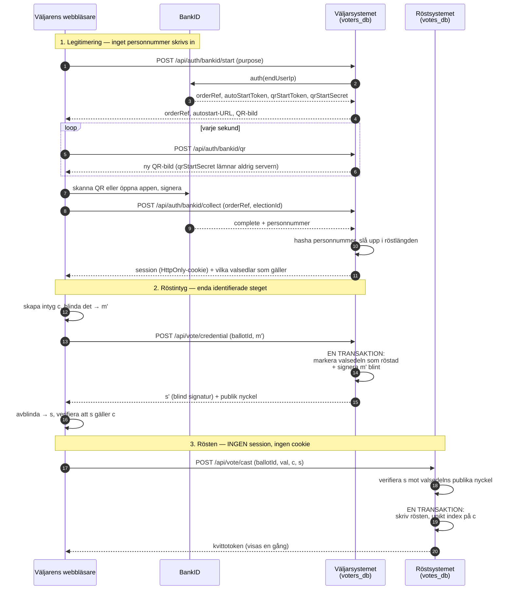

# Arkitektur

Teknisk beskrivning av hur systemet är byggt och varför.

Säkerhetsresonemangen finns i [SECURITY.md](SECURITY.md). Den oberoende
verifierbarheten beskrivs i [VERIFIABILITY.md](VERIFIABILITY.md). Här beskrivs
konstruktionen.

---

## 1. Grundidén i en bild

Systemet består av två delar som avsiktligt inte kan nå varandras data.

```
┌──────────────────────────────────┐        ┌──────────────────────────────────┐
│  VÄLJARSYSTEMET                  │        │  DET ANONYMA RÖSTSYSTEMET        │
│  src/modules/eligibility/        │        │  src/modules/anonymous-vote/     │
│                                  │        │                                  │
│  Vet:  vem du är                 │        │  Vet:  vad som röstats           │
│        om du får rösta           │        │        hur många röster          │
│        vilka valsedlar du röstat │        │        vilka intyg som lösts in  │
│        på                        │        │                                  │
│                                  │        │  Vet inte: vem som röstat        │
│  Vet inte: vad du röstat på      │        │                                  │
│                                  │        │                                  │
│  Databas: voters_db              │        │  Databas: votes_db               │
└──────────────────────────────────┘        └──────────────────────────────────┘
                 │                                          │
                 │            INGEN KODVÄG                  │
                 │      ───────────────────────             │
                 │      Röstläggningen importerar           │
                 │      ingenting från väljarsidan.         │
                 │      Väljaren bär själv över             │
                 │      gränsen — se avsnitt 4.             │
                 ▼                                          ▼
          Blint signerat                              Anonym röst
            röstintyg      ──── väljarens webbläsare ────►  + token
```

Separationen upprätthålls i **fyra oberoende lager**:

| Lager | Vad det gör | Går sönder om |
|---|---|---|
| **Topologiskt** | Två PostgreSQL-databaser. En foreign key mellan dem är fysiskt omöjlig. | någon slår ihop databaserna |
| **Typmässigt** | Röstmodulens kontrakt har ingen parameter som kan bära identitet. | någon lägger till ett fält |
| **Kryptografiskt** | Blindningen gör utfärdande och inlösen statistiskt oberoende. | klientkoden manipuleras |
| **Genom test** | Arkitekturtester läser källkoden och failar vid överträdelse. | någon tar bort testet |

Ett lager kan brista utan att de andra gör det. Det är hela poängen med fyra.

---

## 2. Vad som ändrades, och varför det är värt att veta

Systemet har byggts om i grunden en gång. Den gamla konstruktionen hade en
**session** som följde väljaren ända in i röstläggningen:

```
FÖRE:   legitimera ──► session ──► [session + partival] ──► skriv röst
                                    ▲
                                    └─ identitet och partival i samma
                                       anropsstack under några millisekunder
```

```
EFTER:  legitimera ──► session ──► blint signerat intyg ──► väljarens webbläsare
                                                                    │
        [intyg + val, INGEN session] ◄──────────────────────────────┘
                     │
                     ▼
                skriv röst
```

Tre saker följde av det:

**Röstläggningen har ingen session.** Rutten läser ingen cookie och importerar
ingenting från väljarsidan. Den *kan* inte veta vem som röstar.

**Orkestreringslagret för röstläggning försvann.** Det hade inget att
orkestrera längre.

**Ordningsproblemet försvann.** Tidigare kunde en krasch mellan de två
skrivningarna ge en förlorad röst eller en dubbelröst. Nu sker markering och
utfärdande i *en* transaktion, och inlösen är idempotent.

---

## 3. Blinda signaturer, förklarat enkelt

Det här är mekanismen som bär hela systemet. Den är enklare än den låter.

### Liknelsen

Föreställ dig ett **kuvert med kolpapper på insidan**.

```
   1. Du skriver                2. Du lägger det              3. Myndigheten
      din lott                     i kuvertet                    signerar KUVERTET
                                                                 (ser aldrig lotten)

   ┌─────────┐                  ╔═══════════╗                  ╔═══════════╗
   │ LOTT    │                  ║ ┌───────┐ ║                  ║ ┌───────┐ ║
   │ nr 4711 │      ──────►     ║ │ LOTT  │ ║      ──────►     ║ │ LOTT  │ ║
   │         │                  ║ │ 4711  │ ║                  ║ │ 4711  │ ║
   └─────────┘                  ║ └───────┘ ║                  ║ └───────┘ ║
                                ╚═══════════╝                  ╚═══✍═══════╝
                                 kolpapper                      signatur på kuvertet
                                                                → trycks igenom
                                                                  till lotten

   4. Du river upp kuvertet och kastar det. Kvar har du din lott
      MED myndighetens signatur på — och myndigheten har aldrig sett
      vilket nummer den signerade.

                                 ┌─────────┐
                                 │ LOTT    │
                                 │ nr 4711 │
                                 │    ✍    │  ← giltig signatur
                                 └─────────┘
```

Myndigheten kan intyga *att* den signerat en lott till dig. Den kan inte säga
*vilken*. När lotten senare lämnas in går det att verifiera signaturen — men
inte att se vem som fick den.

### Samma sak i matematik

Kuvertet är en multiplikation med ett slumptal.

```
    Din webbläsare                          Myndigheten
    ──────────────                          ───────────

 1. c  = 32 slumpbytes                    (intyget — ditt hemliga nummer)
    r  = slumptal                          (blindningsfaktorn — kuvertet)

 2. m  = FDH(c)                            (hasha intyget över hela domänen)

 3. m' = m · rᵉ mod n        ──────────►   ser bara m'
                                           ▲
                                           │  m' är LIKFORMIGT slumpad,
                                           │  alltså statistiskt oberoende
                                           │  av m. Ingen information alls.
                                           │
 4.                          ◄──────────   s' = (m')ᵈ mod n   (signerar blint)

 5. s  = s' · r⁻¹ mod n                    (riv upp kuvertet)

 6. Nu gäller: sᵉ ≡ m (mod n)              ← en giltig signatur över c
```

Steg 3 är kärnan. `rᵉ mod n` är likformigt fördelad när `r` är likformigt
slumpad, så `m'` avslöjar ingenting om `m`. Det är **inte** svårt att koppla
ihop utfärdande och inlösen — det är informationsteoretiskt omöjligt, även för
den som sparat allt servern någonsin sett.

Steg 5 fungerar för att RSA är multiplikativ: `(m · rᵉ)ᵈ = mᵈ · r`, och att
dividera bort `r` lämnar `mᵈ` kvar.

### Varför hashen måste täcka hela domänen

Just för att RSA är multiplikativ finns en attack. Med två signaturer i handen
kan man räkna fram en tredje:

```
    sig(a) · sig(b) = sig(a · b)
```

Signerades en kort hash direkt kunde en väljare med två utfärdade intyg prägla
ett tredje som aldrig utfärdats — en extra röst som ser fullt auktoriserad ut.

`FDH` (full-domain hash, via MGF1-SHA256) expanderar hashen över hela
modulusens bredd. Produkten av två sådana värden är med överväldigande
sannolikhet inte en giltig hash för *något* meddelande, och attacken faller.

Ett test i `tests/unit/blind-signature.test.ts` utför attacken och kontrollerar
att den misslyckas.

### Ett nyckelpar per valsedel

Myndigheten signerar blint och ser alltså inte vilken valsedel intyget gäller.
Bindningen måste därför komma från **vilken nyckel som signerade**:

```
    Kommunvalsedeln  ──► nyckelpar K₁ ──► intyg giltigt BARA i kommunvalet
    Landstingsvalet  ──► nyckelpar K₂ ──► intyg giltigt BARA i landstingsvalet
    Riksdagsvalet    ──► nyckelpar K₃ ──► intyg giltigt BARA i riksdagsvalet
```

Utan det kunde en väljare begära tre intyg och lösa in alla tre på samma
valsedel.

---

## 4. Röstningsflödet, steg för steg



### Var identiteten slutar

```
  ┌────────────────────────────────────────────────────────────────┐
  │  IDENTIFIERAT                                                  │
  │  BankID → röstberättigande → markering → blind signering       │
  │                                                                │
  │  Systemet vet vem du är. Det vet inte vilket intyg du fick.    │
  └────────────────────────────────────────────────────────────────┘
                              ║
                     ═════════╬═════════  väljarens webbläsare
                              ║           bär intyget över
                              ▼
  ┌────────────────────────────────────────────────────────────────┐
  │  ANONYMT                                                       │
  │  intyg + val → verifiera signatur → skriv röst → token         │
  │                                                                │
  │  Systemet vet vad som röstats. Det kan inte veta av vem.       │
  └────────────────────────────────────────────────────────────────┘
```

### Varför ordningen inte längre spelar roll

```
  Utfärdandet:   ┌─ markera valsedel som röstad ─┐
                 │                                │  EN transaktion, EN databas
                 └─ signera det blindade värdet ──┘

  Inlösen:       ┌─ skriv rösten ────────────────┐  EN transaktion, EN databas
                 └─ unikt index på credential_id ┘  → idempotent
```

Ingen skrivning korsar databasgränsen. Kraschar något mellan stegen har
väljaren antingen inget intyg (kan börja om) eller ett oförbrukat intyg (kan
lösa in det senare). **Varken dubbelröstning eller förlorad röst kan uppstå.**

Ett utfärdat men aldrig inlöst intyg syns som en avvikelse i slutkontrollen, så
en avbruten röstning försvinner inte tyst.

---

## 5. Datamodell

### voters_db — vet vem, aldrig vad

```
  voter_status                      election  (spegling)
  ├─ id                             ├─ id            ← samma UUID som votes_db
  ├─ external_identity_hash         ├─ name
  │    HMAC(personnummer, pepper)   ├─ kind
  ├─ is_eligible                    ├─ opens_at
  ├─ is_admin                       └─ closes_at
  ├─ municipality_code                     │
  └─ region_code                           ▼
        │                           election_ballot  (spegling)
        │                           ├─ id            ← samma UUID
        │                           ├─ kind          KOMMUN|LANDSTING|RIKSDAG|FRAGA
        │                           ├─ area_code
        ▼                           ├─ signing_private_key_pem   ⚠ se avsnitt 10
  voter_ballot_status  ◄────────────┤ signing_public_key_pem
  ├─ voter_status_id                └─ ...
  ├─ ballot_id
  └─ voted_at    (dygnsupplösning)
     UNIQUE(voter_status_id, ballot_id)  ← dubbelröstningsspärren

  voting_session     kortlivad, raderas när omröstningen är avklarad
  admin_session      egen tabell, aldrig en flagga på röstsessionen
  push_subscription  INGEN foreign key — en push-endpoint är en enhetsidentifierare
  audit_event        hashkedja med löpnummer
```

### votes_db — vet vad, aldrig vem

```
  election                election_ballot           party  (förskapat register)
  ├─ id                   ├─ id                     ├─ name        UNIQUE
  ├─ name                 ├─ kind                   ├─ abbreviation
  ├─ kind                 ├─ allows_candidate_vote   └─ color
  ├─ status               ├─ signing_public_key_pem         │
  ├─ opens_at             └─ ...                            │
  └─ closes_at                   │                          │
        │                        ├──────────────┬───────────┘
        ▼                        ▼              ▼
  election_commitment      ballot_option    ballot_party
  ├─ sequence              └─ label         └─ ...
  ├─ root    Merklerot                            │
  ├─ vote_count                                   ▼
  ├─ previous_hash   ← kedja                 candidate
  └─ entry_hash                              └─ name

  anonymous_vote
  ├─ token_hash            UNIQUE   SHA-256 av väljarens kvitto
  ├─ credential_id         UNIQUE   ← engångsanvändning = idempotens
  ├─ credential_signature           myndighetens blinda signatur
  ├─ ballot_id
  ├─ ballot_party_id / option_id
  ├─ candidate_id                   personröst, frivillig
  └─ created_at            timupplösning
```

### Vad som medvetet inte finns

| I voters_db saknas | I votes_db saknas |
|---|---|
| parti, kandidat, svarsalternativ | identitet, identitetshash |
| token, token-hash | väljar-id, sessions-id |
| röst-id | IP-adress, request-id |
| | geografisk markering på rösten |

Ett säkerhetstest läser båda schemana och failar om något av det dyker upp.

---

## 6. Verifierbarhet — Merkleträd, inte hashkedja

Kravet är att en ändrad eller borttagen röst ska upptäckas. Den självklara
lösningen vore en hashkedja — men den går inte att använda här.

```
  HASHKEDJA (går inte)                MERKLETRÄD SORTERAT PÅ INNEHÅLL (fungerar)

  röst₁ ──► röst₂ ──► röst₃            hash(röst₁)  hash(röst₂)  hash(röst₃)
    #1       #2       #3                    │            │            │
                                            └──── sorterade på hash ──┘
  Löpnummer ÄR en ordning.                          │        │
  Tillsammans med röstlängden                       └───┬────┘
  går rösterna att para ihop                             ▼
  med väljarna i tidsföljd.                            ROT

                                       Ordningen kommer ur INNEHÅLLET.
                                       Trädet ser likadant ut oavsett
                                       när rösterna kom in.
```

En kedja i insättningsordning hade **rivit ned tidsskyddet för att bygga upp
manipulationsskyddet**. Hela skälet till att tidsstämplarna är grova är att
rösterna inte ska gå att sortera i samma följd som väljarna legitimerade sig.

Tre detaljer i trädet stänger varsin känd attack:

```
  hash(löv)  = SHA256( 0x00 ‖ innehåll )      ← prefix skiljer löv från nod
  hash(nod)  = SHA256( 0x01 ‖ vänster ‖ höger )
  rot        = SHA256( 0x02 ‖ antal ‖ topp )  ← domänseparerad, binder antalet
```

Utan lövprefixet kan en intern nod presenteras som ett löv. Utan rotprefixet
blir roten för ett träd med *ett* löv identisk med lövet självt — den svagheten
hittades av ett test under utvecklingen. Och udda noder lyfts upp i stället för
att dubbleras, eftersom `hash(x, x)` låter två olika mängder ge samma rot.

### Åtagandekedjan

```
  åtagande #1        åtagande #2        åtagande #3
  ├─ rot A           ├─ rot B           ├─ rot C
  ├─ 5 röster        ├─ 12 röster       ├─ 31 röster
  ├─ prev: null      ├─ prev: hash(#1)  ├─ prev: hash(#2)
  └─ hash(#1)  ──────┴─ hash(#2)  ──────┴─ hash(#3)
```

Varje åtagande binder in det föregående, så historiken går inte att skriva om.
**Här är ordningen oproblematisk** — åtagandena är få, publicerade och innehåller
inga röster. Det är rösterna som inte får gå att ordna, inte åtagandena om dem.

> Ett åtagande som bara finns i samma databas som det skyddar kan skrivas om
> tillsammans med rösterna. Rötterna måste publiceras externt för att ha fullt
> bevisvärde — se avsnitt 10.

---

## 7. Slutkontroll och fastställande

```
                    ┌─────────────────────────────┐
                    │  POST /admin/elections/check │
                    │  Kör nio kontroller          │
                    └──────────────┬──────────────┘
                                   ▼
        ┌──────────────────────────────────────────────────┐
        │  KRITISK          underlaget stämmer inte        │
        │  PRECONDITION     inte klart än                  │
        │  WARNING          värt att veta, inget hinder    │
        └──────────────────────────────────────────────────┘
                                   │
                    ┌──────────────┴──────────────┐
                    ▼                             ▼
        ┌───────────────────────┐    ┌────────────────────────────┐
        │ POST /certify         │    │ Kritisk kontroll fallerade │
        │ kör kontrollen OM     │    │ → status UNDER_REVIEW      │
        │ ingen force-parameter │    │ → går inte att lämna via   │
        │ finns                 │    │   applikationen            │
        └───────────┬───────────┘    └────────────────────────────┘
                    ▼
        publicera sista åtagandet → status CERTIFIED
```

**Skillnaden mellan KRITISK och PRECONDITION är inte kosmetisk.** Att
omröstningen fortfarande är öppen är ingen avvikelse — det är bara för tidigt.
Räknades det som en avvikelse hade en administratör som klickade en dag för
tidigt gjort valet permanent omöjligt att fastställa, eftersom `UNDER_REVIEW`
inte går att lämna via applikationen.

Kontroll 2 — *har varje röst skapats genom den auktoriserade processen?* — är den
enda som inte kan förfalskas inifrån. De övriga jämför siffror i databaser, som
den med skrivrättigheter kan ändra. Den verifierar en signatur, och samma
kontroll kan köras av vem som helst med den publika nyckeln.

---

## 8. Modulkontrakt

### `src/modules/anonymous-vote/index.ts`

```ts
export type CastAnonymousVoteInput = {
  ballotId: string
  ballotPartyId?: string
  candidateId?: string
  optionId?: string
  credentialId: string
  credentialSignature: string
}
```

Sex identifierare som alla pekar på rader i röstdatabasen. **Ingen parameter kan
bära identitet**, och inget fält kan gruppera flera röster — väljaren i ett
riksdagsval anropar funktionen tre gånger, och de tre anropen har ingenting
gemensamt som lagras.

Ett test kontrollerar att fältmängden är exakt denna. Ett nytt fält ska kräva
ett medvetet beslut, inte glida igenom.

### Filer som ser båda sidorna

| Fil | Varför det är försvarbart |
|---|---|
| `orchestration/create-election.usecase.ts` | offentlig metadata; ingen väljare och ingen röst finns ännu |
| `orchestration/final-check.usecase.ts` | rena antal; kan inte para ihop sidorna |
| `api/admin/stats/route.ts` | aggregat, aldrig rader |
| `api/observer/election/route.ts` | samma siffra, publicerad |
| `api/demo/database-state/route.ts` | avkortade värden, sorterade |

Listan **krympte** när röstintygen infördes: röstläggningen behöver ingen
session och orkestreras därför inte längre.

---

## 9. BankID v6 (Secure Start)

Det finns **ingen ruta för personnummer**, och det är inget val vi gjort.

```
  ANNAN ENHET                          SAMMA ENHET
  ───────────                          ───────────
  animerad QR-kod                      autostart-token

  qrAuthCode = HMAC-SHA256(            bankid:///?autostarttoken=…
      qrStartSecret, sekunder)             &redirect=null
  qrData = bankid.<token>.
      <sekunder>.<qrAuthCode>          iOS: https://app.bankid.com/?…

  ny kod VARJE SEKUND                  redirect=null är hårdkodat
  hemligheten stannar på servern       → ingen påverkbar omdirigering
```

BankID tillåter inte längre inmatade personnummer: en illasinnad app kan annars
förmå någon att signera genom att mata in ett personnummer den kommit över.

**För det här systemet är det en förbättring.** Den gamla inmatningsrutan
svarade medvetet likadant oavsett om personnumret fanns i röstlängden — men tog
ändå emot godtyckliga personnummer från vem som helst. Nu kommer personnumret
först i BankID:s svar, efter att personen legitimerat sig på sin egen enhet.

Att koden byts varje sekund är inte kosmetik: en statisk kod går att fotografera
och skicka till någon som luras att skanna den. En kod som dör inom en sekund
hinner inte vidarebefordras.

---

## 10. Vad arkitekturen ska vara, och var koden avviker

Det här avsnittet är **specifikationen**, inte en beskrivning. Avvikelser är
buggar tills de uttryckligen godkänts som något annat.

Listan över kända avvikelser ligger i `src/lib/known-limitations.ts` och läses
av både arkitektursidan och ett säkerhetstest. Varje avvikelse pekar ut en
markör i källkoden som är sann **så länge problemet finns kvar** — löser någon
problemet försvinner markören, testet failar, och bygget står still tills
posten tagits bort.

Det är omvänd logik: **ett test som failar när systemet blir bättre.** Skälet är
erfarenhet. Ordningsproblemet mellan de två databasskrivningarna löstes av
röstintygen men stod kvar som ett kvarvarande problem i prosa på tre ställen
långt efteråt — och en demonstration som påstår att systemet är sämre än det är
underminerar tilliten lika säkert som en som påstår motsatsen.

De tre viktigaste avvikelserna:

**Klientkoden levereras av servern.** Blindningen sker i webbläsaren, men koden
kommer från den som ska granskas. Det här är en **teoretisk gräns för webbaserad
kryptografi**, inte en bugg — den går bara att flytta, till en separat
distribuerad och signerad klient.

**Signeringsnycklarna ligger i databasen.** En backup i fel händer räcker för att
prägla giltiga röstintyg. Nycklarna hör hemma i en HSM. Det *är* en bugg, och
den är åtgärdbar.

**Kvittot bevisar hur du röstat.** Verifieringen visar vilket alternativ token
gäller, vilket gör röstköp praktiskt genomförbart. Målet är kvittofrihet plus
cast-or-audit — se [VERIFIABILITY.md](VERIFIABILITY.md).

---

## 11. Applikationslager

**Middleware** sätter säkerhetsheaders och en CSP med **nonce per begäran**.
Nonce, inte `unsafe-inline`: Next.js levererar sin hydreringsbootstrap som
inline-skript, och en policy med enbart `script-src 'self'` blockerar dem — då
hydrerar React aldrig och ingen interaktiv sida fungerar. Det upptäcks inte av
något test som inte startar en riktig webbläsare.

**Loggen** maskerar kända hemlighetsmönster. Ett test failar om någon fil loggar
direkt till `console`.

**Hastighetsbegränsningen** är per IP och nyckeln hashas. Gränsen för
legitimeringsstart är medvetet generös: ett bibliotek eller en mobiloperatörs NAT
delar adress mellan hundratals personer, och en stram gräns hade låst ut den
sjätte väljaren. Den verkliga risken kräver en gräns **per personnummer** — se
avsnitt 10.

**Tidsstämplar** avrundas i `lib/time.ts`: dygn i röstlängden, timme i
röstdatabasen. Ingenting i systemet lagrar en exakt tidpunkt för en enskild
väljare eller röst.
