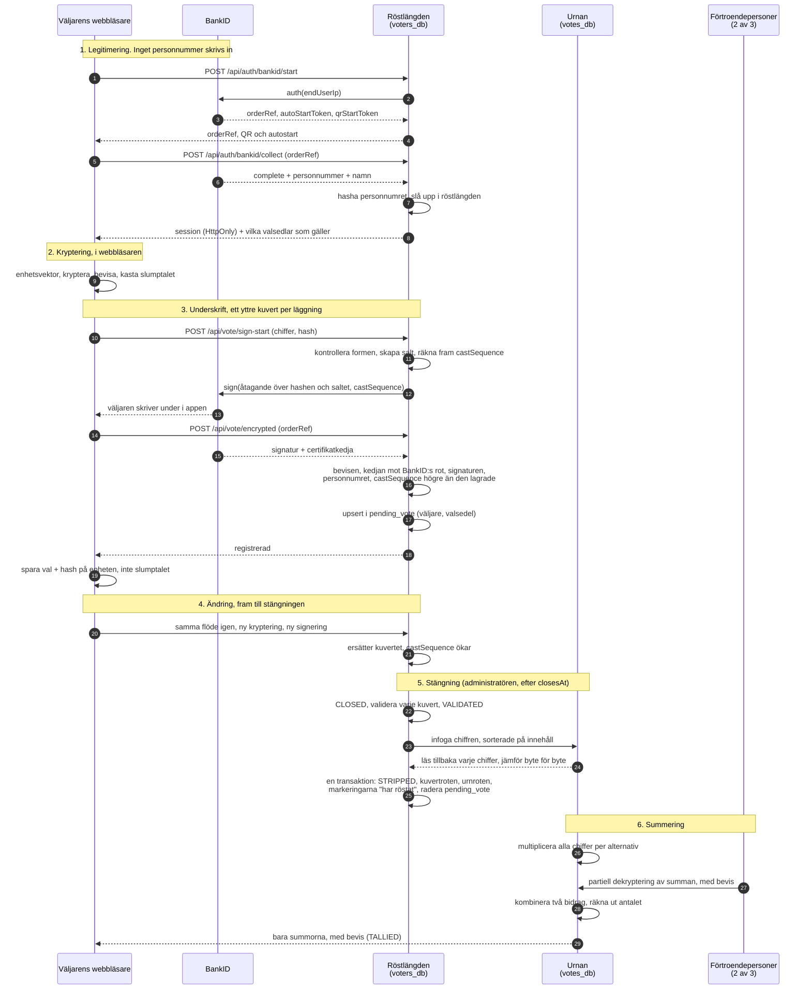

# Arkitektur

Teknisk beskrivning av hur systemet är byggt och varför.

Det som är bindande är specen, [docs/spec/2026-09-22-dubbla-kuvert.md](docs/spec/2026-09-22-dubbla-kuvert.md).
Hotmodellen och de kända begränsningarna står i dess avsnitt 10. Det här dokumentet
beskriver konstruktionen och säger emot specen ingenstans. Gör det det är det dokumentet
som har fel.

Säkerhetsresonemangen finns i [SECURITY.md](SECURITY.md). Verifierbarheten beskrivs i
[VERIFIABILITY.md](VERIFIABILITY.md). Samma sak för den som aldrig hört ordet kryptering
finns i appen, på `/architecture`.

---

## 1. Grundidén i en bild

Systemet bygger på modellen med **dubbla kuvert**, som Estland använder. Det inre
kuvertet är valsedeln, krypterad så att ingen enskild kan öppna den. Det yttre kuvertet
är väljarens egen BankID-underskrift över det inre.

```
   väljarens webbläsare
   ┌──────────────────────────────────────────────────────────┐
   │  1. välj, kryptera, bevisa  ──►  inre kuvert (chiffer)   │
   │  2. skriv under med BankID  ──►  yttre kuvert            │
   │  3. kasta slumptalet                                     │
   └───────────────────────────────┬──────────────────────────┘
                                   ▼
┌─────────────────────────────────────────┐   stängningen   ┌──────────────────────────┐
│  RÖSTLÄNGDEN, voters_db                 │  flyttar bara   │  URNAN, votes_db         │
│  src/modules/eligibility/               │  chiffren       │  src/modules/ballot-box/ │
│                                         │ ──────────────► │                          │
│  Vet: vem du är, om du fått rösta,      │  och raderar    │  Vet: chiffer, bevis,    │
│       att du röstat, och under          │  kopplingen     │       räkneverk          │
│       röstningen vilket chiffer         │                 │                          │
│       som är ditt                       │                 │  Vet inte: vem som       │
│  Vet inte: vad chiffret innehåller      │                 │  röstat                  │
└─────────────────────────────────────────┘                 └──────────────────────────┘
                                                                     │
                                  k av n förtroendepersoner (2 av 3) ▼
                                                      summan öppnas, bara summan
```

Det är **inte** en modell där kopplingen mellan väljare och röst aldrig finns. Den finns
medan röstningen pågår, med avsikt: det är den som gör att väljaren kan ändra sig och att
en köpt röst kan ersättas ända fram till stängningen. Kopplingen finns i `voters_db`, i
tabellen `pending_vote`, och rösten i den är ett chiffer som ingen kan läsa utan två av
tre andelar av valets nyckel. Vid stängningen flyttas chiffren till `votes_db`, kopplingen
raderas och bara summan öppnas. Priset, och det är den huvudsakliga invändningen mot
Estlands system, är att "kan inte existera" blivit "raderas enligt schema". Backuper,
läsreplikor och WAL-loggen omfattas inte av raderingen. Se spec 10 och
[SECURITY.md](SECURITY.md) avsnitt 4.6.

Separationen hålls av fem lager, och de skyddar olika saker:

| Lager | Vad det gör | Går sönder om |
|---|---|---|
| **Topologiskt** | Två PostgreSQL-databaser. En foreign key mellan dem är fysiskt omöjlig, så en räknad röst kan inte peka på en väljare. | någon slår ihop databaserna |
| **Schemat** | `votes_db` har ingen kolumn för identitet. `tests/security/schema-separation.test.ts` läser schemat och går rött om någon läggs till. | någon tar bort testet |
| **Modulgränsen** | Bara ett fåtal namngivna filer får importera från båda sidorna, och `tests/security/module-boundaries.test.ts` kräver att listan är exakt den. Skalningen är den enda filen som med flit flyttar kuvert över gränsen. | någon lägger till en fil i listan utan skäl |
| **Kryptografiskt** | Chiffret går inte att läsa utan k av n andelar. Varje andel är låst med en lösenfras som aldrig lagras. Fraserna sätts i praktiken av administratören vid skapandet, se avsnitt 10. | k förtroendepersoner går ihop, eller en andel och dess fras läcker |
| **Raderingen** | Vid stängningen raderas `pending_vote`, och kopplingen finns inte längre i den levande databasen. | en kopia från före stängningen finns kvar |

Lagren är olika starka under olika faser. Före stängningen bär det kryptografiska lagret
ensamt valhemligheten mot den som läser röstlängden. Efter stängningen bär de alla.

---

## 2. Vad som ändrades, och varför det är värt att veta

Systemet har byggts om i grunden två gånger. Den första konstruktionen hade en session
som följde väljaren ända in i röstläggningen. Den andra, med blinda signaturer, gjorde
kopplingen mellan väljare och röst fysiskt omöjlig. Det gav utmärkt valhemlighet, men
löste inte röstköp. Specen (avsnitt 1) går igenom varför:

- **Kvittot bevisade vad väljaren röstat.** Varje publicerad rad som parar ett handtag
  väljaren känner med ett val i klartext förstör kvittofriheten.
- **Vilket handtag som än låter väljaren ändra sig låter köparen göra det.** Kopplingen
  till identitet är därför en nödvändighet för en röst som går att ändra, inte en genväg.

Den nuvarande modellen väljer därför kopplingen under röstningen och raderar den vid
stängningen. Den gamla konstruktionen, med blindsignering, röstintyg och kvittotoken, är
borttagen ur koden (uppgift 15).

---

## 3. Dubbla kuvert, förklarat enkelt

Det här är mekanismen som bär hela systemet.

### Liknelsen

Föreställ dig en **brevröst**.

```
   1. Du lägger din       2. Du stoppar det        3. Du skriver namn
      valsedel i ett         i ett yttre kuvert       och underskrift
      inre kuvert, som       med ditt namn            på det yttre
      ingen kan öppna        och underskrift
                                                                       ╔═══════════╗
   ┌───────────┐          ╔═══════════════╗          ╔═══════════════╗ ║ Anna ✍    ║
   │ ░░░░░░░░░ │  ──────► ║ ┌───────────┐ ║  ──────► ║ ┌───────────┐ ║ ╚═══════════╝
   │ ░ inre ░░ │          ║ │ ░ inre ░░ │ ║          ║ │ ░ inre ░░ │ ║
   └───────────┘          ║ └───────────┘ ║          ║ └───────────┘ ║
                          ╚═══════════════╝          ╚═══════════════╝

   4. Valmyndigheten ser vem som skickat det yttre kuvertet och kan
      byta ut det mot ett nytt, om du ändrar dig.

   5. Vid stängningen kontrolleras de yttre kuverten. Sedan öppnas de,
      och de inre läggs i en gemensam urna, sorterade på innehåll, utan
      de yttre. Ingen kan längre se vilket som var vems, i den
      levande databasen (se "Vad konstruktionen inte ger").

   6. Det inre kuvertet kan inte öppnas av någon enskild. Två av tre
      förtroendepersoner tillsammans kan öppna kuverten, och urnans summa.
      Systemet öppnar aldrig något enskilt kuvert, men två andelar gör det
      tekniskt möjligt.
```

Myndigheten vet alltså under röstningen **att** Anna röstat och kan byta ut hennes inre
kuvert när hon ändrar sig. Den kan inte läsa det. Efter stängningen finns inga namn kvar
vid kuverten i den levande databasen. Det gäller inte backuper, WAL eller BankID, och inte en
valsedel med så få röster att markeringarna eller summan pekar ut rösten (spec 10).

### Samma sak i matematik

Det inre kuvertet är en **ElGamal-kryptering** i gruppen RFC 3526 MODP Group 14, med
generatorn `g = 4` (spec 4.1). Nyckeln `h = g^x` är valets publika nyckel, och `x`,
den privata, delas mellan tre förtroendepersoner med Shamirs delning. Två andelar räcker.

```
    Din webbläsare                                  Servern

 1. Valsedeln har M alternativ: blankt, partierna,
    kandidaterna. Du väljer ett.
    Rösten är en vektor: en etta, resten nollor.

 2. För varje alternativ, med ett slumptal r:
        c1 = g^r             c2 = h^r · g^m         (m är 0 eller 1)

 3. Bevis, som servern kontrollerar:
      – varje m är 0 eller 1                    (Chaum–Pedersen, 0-eller-1)
      – alla m tillsammans summerar till 1      (Chaum–Pedersen, summa)
    Utmaningarna binder valets id, valsedelns id,
    den publika nyckeln och hela chifferlistan
    (stark Fiat–Shamir, spec 4.4).

 4. Slumptalen r KASTAS.                         Servern får chiffer + bevis.
```

Två egenskaper gör att urnan går att räkna utan att något kuvert öppnas.

**Chiffren går att multiplicera.** Komponentvis produkt av två chiffer är ett chiffer av
summan. Urnans summa för ett alternativ är alltså produkten av alla chiffer för det
alternativet, och den summan är det enda som dekrypteras.

**Valsedeln bevisar sin form.** Utan bevisen kunde en väljare lägga `1000` på sin kandidat
och ingen skulle märka det förrän summan var orimlig. Beviset säger att exakt ett
alternativ har fått en etta, utan att säga vilket. Utan alternativet "blankt" kunde den
som inte vill rösta på något inte lägga en vektor som summerar till ett.

### Slumptalet som kastas

Det avgörande greppet för kvittofriheten: klienten behåller inte slumptalet `r`. Därför
kan väljaren inte bevisa vad hennes chiffer innehåller, för någon annan. Enheten sparar
valet och chifferhashen så att väljaren kan se sin nuvarande röst före stängningen, men
det som visas är inget kvitto, eftersom ingen kan visa att chiffret innehåller det
enheten säger, och väljaren kan själv skriva om det enheten visar (spec 3.1).

### Vad konstruktionen inte ger

- **Valhemlighet under röstningen mot den som har tillräckligt många andelar.** Under
  röstningen ligger kuverten bredvid namnen. Två andelar och en databas öppnar varje
  kuvert, inte bara summan. I demon skyddar fraserna ingenting, eftersom de står i repot.
- **Klientintegritet.** Webbläsarkoden kommer från servern. En manipulerad klient kan
  kryptera något annat än väljaren valde, eller behålla slumptalet. Motmedlet,
  cast-or-audit, ligger utanför specen.
- **Skydd mot tvång vid själva slutet.** Den som ser väljaren lägga rösten strax före
  stängningen vet att den gäller.
- **Universell verifierbarhet röst för röst.** Att summan består av exakt de giltiga
  rösterna kan allmänheten inte räkna om. Det vilar på valideringen före stängningen
  och på slutkontrollen, som den som driver systemet kör (spec 3.1).
- **Skydd mot BankID.** BankID vet vem som röstade, på vilken valsedel, när och hur många
  gånger.

Hela listan, med exakt avgränsning, står i spec 10 och i
`src/lib/known-limitations.ts`, och visas på `/architecture/technical`.

### Egenskaperna och vad var och en vilar på

| Egenskap | Vilar på | Gäller inte |
|---|---|---|
| Valhemlighet | Att enskilda röster aldrig dekrypteras, bara summan. Chiffret är låst bakom k av n andelar. | Den som har k andelar och en kopia från före stängningen. Se SECURITY.md 2.2. |
| Motstånd mot röstköp | Att rösten kan ändras fram till stängningen, och att inget publicerat efteråt går att matcha mot. | Tvång vid slutet. |
| Kvittofrihet | Att klienten kastar slumptalet och att enskilda chiffer och hashar aldrig publiceras, utom i demons livevy. | En manipulerad klient som behåller slumptalet. |
| Individuell verifierbarhet | Före stängningen: enheten jämför sin sparade hash med servern, som svarar lika, olika eller ingen röst. Efter: markeringen "har röstat". | Efter stängningen kan ingen se vad hon röstade. |
| Universell verifierbarhet | Att resultatet är en korrekt dekryptering av den publicerade summan, med bevis. | Att summan består av exakt de giltiga rösterna. |
| Ingen röst kan förfalskas av en klient | Väljarens BankID-signatur med kedja till BankID:s rot. | Den som driver systemet kan ta bort ett äkta kuvert eller lägga tillbaka ett äldre. I demon utfärdar attrappen certifikaten. |
| Resultatet öppnas av två av tre förtroendepersoner | k-av-n-tröskeldekryptering med lösenfraser. | En administratör som skapat omröstningen och därmed känner alla tre fraser. Skapandet och fastställandet gör dessutom en administratör ensam. |

---

## 4. Röstningsflödet, steg för steg


```mermaid
sequenceDiagram
    autonumber
    participant W as Väljarens webbläsare
    participant B as BankID
    participant E as Röstlängden<br/>(voters_db)
    participant A as Urnan<br/>(votes_db)
    participant T as Förtroendepersoner<br/>(2 av 3)

    Note over W,B: 1. Legitimering. Inget personnummer skrivs in
    W->>E: POST /api/auth/bankid/start
    E->>B: auth(endUserIp)
    B-->>E: orderRef, autoStartToken, qrStartToken
    E-->>W: orderRef, QR och autostart
    W->>E: POST /api/auth/bankid/collect (orderRef)
    B-->>E: complete + personnummer + namn
    E->>E: hasha personnumret, slå upp i röstlängden
    E-->>W: session (HttpOnly) + vilka valsedlar som gäller

    Note over W: 2. Kryptering, i webbläsaren
    W->>W: enhetsvektor, kryptera, bevisa, kasta slumptalet

    Note over W,E: 3. Underskrift, ett yttre kuvert per läggning
    W->>E: POST /api/vote/sign-start (chiffer, hash)
    E->>E: kontrollera formen, skapa salt, räkna fram castSequence
    E->>B: sign(åtagande över hashen och saltet, castSequence)
    B-->>W: väljaren skriver under i appen
    W->>E: POST /api/vote/encrypted (orderRef)
    B-->>E: signatur + certifikatkedja
    E->>E: bevisen, kedjan mot BankID:s rot, signaturen,<br/>personnumret, castSequence högre än den lagrade
    E->>E: upsert i pending_vote (väljare, valsedel)
    E-->>W: registrerad
    W->>W: spara val + hash på enheten, inte slumptalet

    Note over W,E: 4. Ändring, fram till stängningen
    W->>E: samma flöde igen, ny kryptering, ny signering
    E->>E: ersätter kuvertet, castSequence ökar

    Note over E,A: 5. Stängning (administratören, efter closesAt)
    E->>E: CLOSED, validera varje kuvert, VALIDATED
    E->>A: infoga chiffren, sorterade på innehåll
    A-->>E: läs tillbaka varje chiffer, jämför byte för byte
    E->>E: en transaktion: STRIPPED, kuvertroten, urnroten,<br/>markeringarna "har röstat", radera pending_vote

    Note over A,T: 6. Summering
    A->>A: multiplicera alla chiffer per alternativ
    T->>A: partiell dekryptering av summan, med bevis
    A->>A: kombinera två bidrag, räkna ut antalet
    A-->>W: bara summorna, med bevis (TALLIED)
```

### Var identiteten slutar

```
  ┌────────────────────────────────────────────────────────────────┐
  │  RÖSTLÄNGDEN, medan röstningen pågår                           │
  │  BankID → röstberättigande → yttre kuvert + inre chiffer       │
  │                                                                │
  │  Systemet vet vem du är och vilket chiffer som är ditt.        │
  │  Det kan inte läsa chiffret.                                   │
  └────────────────────────────────────────────────────────────────┘
                              ║
                     ═════════╬═════════  stängningen
                              ║           flyttar chiffren och
                              ▼           raderar kopplingen
  ┌────────────────────────────────────────────────────────────────┐
  │  URNAN, efter stängningen                                      │
  │  chiffer sorterade på innehåll → summa → räkneverk             │
  │                                                                │
  │  Systemet vet vad som röstats. Det kan inte veta av vem.       │
  └────────────────────────────────────────────────────────────────┘
```

"Kan inte veta av vem" gäller den levande databasen efter stängningen. Det gäller inte
den som har en kopia från före stängningen, och inte BankID. Se avsnitt 10.

### Varför ordningen i stängningen är skyddad

En transaktion över två separata PostgreSQL-databaser är fysiskt omöjlig, och det är
själva poängen med separationen. Två saker bär i stället:

- **Idempotensen.** Urnans rader nycklas per kuvert, med ett id som räknas ur chifferhashen,
  valsedeln och ett löpnummer bland likadana kuvert. En avbruten stängning kan köras om utan
  dubbletter, och får samma id:n. Löpnumret beror bara på innehållet, och säger inget om
  väljaren eller om när kuvertet lades.
- **Fasen är ett tillstånd.** `Election.phase` går bara framåt (avsnitt 5), och övergångarna
  är jämför-och-sätt. Skalningen, `STRIPPED`, kuvertroten, markeringarna och raderingen görs
  i en enda transaktion i röstlängden, så en stängning vars lås gått förlorat kan inte
  heller göra COMMIT på en skalning.

Valideringen är en spärr och ingen rapport. Hittar den en allvarlig avvikelse avbryts
stängningen och ingenting raderas, eftersom att skala ändå vore att kasta bort
bevismaterialet för just det problem man hittat.

---

## 5. Datamodell

### voters_db, röstlängden: yttre kuvert och identitet

```
  voter_status                      election  (spegling)
  ├─ id                             ├─ id            ← samma UUID som votes_db
  ├─ external_identity_hash         ├─ name
  │    scrypt(personnummer, pepper) ├─ kind
  ├─ is_eligible                    ├─ opens_at / closes_at
  ├─ is_admin                       ├─ phase         OPEN→CLOSED→VALIDATED→STRIPPED
  ├─ municipality_code              │                →TALLIED→CERTIFIED
  └─ region_code                    ├─ mode          DEMO | SHARP
        │                           ├─ envelope_root, urn_root
        │                           └─ link_cleared_at
        │                                  │
        ▼                                  ▼
  pending_vote  (det yttre kuvertet)   election_ballot  (spegling)
  ├─ voter_status_id  ──► voter_status   ├─ id, kind, label, area_code
  │    ON DELETE RESTRICT                └─ display_order
  ├─ ballot_id        (ingen FK över databasgräns)
  ├─ ciphertext       M par (c1, c2)
  ├─ proofs           M 0-eller-1-bevis + 1 summabevis
  ├─ ciphertext_hash  SHA-256 över den kanoniska chifferlistan
  ├─ cast_sequence    ökar vid varje läggning, ligger i det signerade
  ├─ bankid_signature            förseglad med AES-256-GCM
  ├─ bankid_certificate_chain    förseglad med AES-256-GCM
  ├─ commitment_salt  saltet i åtagandet BankID skrev under
  ├─ updated_at       dygnsupplösning
  └─ UNIQUE(voter_status_id, ballot_id)

  voted_marker   "har röstat", utan tidskolumn, skrivs vid skalningen
  voting_session     kortlivad (10 min): väljare, omröstning, CSRF-hemlighet. Aldrig ett val.
  admin_session      egen tabell, aldrig en flagga på röstsessionen
  push_subscription  INGEN foreign key. En push-endpoint är en enhetsidentifierare.
  audit_event        hashkedja med löpnummer; urnroten står i posten LINK_CLEARED
```

`pending_vote` **ersätts** när väljaren ändrar sig, och **raderas** vid stängningen.
Främmande nyckeln mot `voter_status` är `RESTRICT` med avsikt: en struken väljares röst
räknas ändå (spec 7.4), och en kaskad hade tyst tagit rösten med sig.

### votes_db, urnan: inre kuvert och räkning

```
  election                election_ballot           party  (förskapat register)
  ├─ id                   ├─ id                     ├─ name        UNIQUE
  ├─ name                 ├─ kind                   ├─ abbreviation
  ├─ kind                 ├─ allows_candidate_vote  └─ color
  ├─ status               └─ ...                           │
  ├─ mode                        │                         │
  ├─ encryption_public_key       ├──────────────┬──────────┘
  ├─ tally_completed_at          ▼              ▼
  └─ certified_at          ballot_option    ballot_party ──► candidate

  encrypted_vote  (det inre kuvertet)       trustee_share
  ├─ id   128 bitar ur SHA-256 över           ├─ trustee_index
  │       chifferhash, valsedel, löpnummer    ├─ public_share     g^{x_i}
  ├─ ballot_id                                └─ encrypted_share  x_i, låst med fras
  ├─ ciphertext, proofs
  └─ ciphertext_hash   inte unik: en kopia räknas   partial_decryption
                                                    ├─ ballot_id, option_index, trustee_index
  ballot_tally                                      ├─ value   c1^{x_i}
  ├─ ballot_id, option_index                        └─ proof
  └─ count
```

### Vad som medvetet inte finns

| I voters_db saknas | I votes_db saknas |
|---|---|
| partival, kandidat, svarsalternativ | identitet och identitetshash |
| klartext till något chiffer | väljar-id, sessions-id |
| tidskolumn på `voted_marker` | IP-adress, request-id |
| | en tidpunkt eller ett löpnummer som ordnar kuverten efter läggningen |

Ett säkerhetstest läser båda schemana och går rött om identitet dyker upp i `votes_db`.
Kopplingen finns däremot i `voters_db`, i `pending_vote`, medan röstningen pågår. Det är
modellen, och det står i den första tabellen i avsnitt 1.

### Faserna är tillstånd

```
  OPEN ──closesAt──► CLOSED ──validering──► VALIDATED ──skalning──► STRIPPED
                                                                        │
                        CERTIFIED ◄──slutkontroll── TALLIED ◄──dekryptering
```

| Fas | Kopplingen finns | Röster tas emot |
|---|---|---|
| `OPEN` | ja | ja |
| `CLOSED` | ja | nej |
| `VALIDATED` | ja | nej |
| `STRIPPED` | nej | nej |
| `TALLIED` | nej | nej |
| `CERTIFIED` | nej | nej |

En dekryptering kan inte beställas förrän omröstningen står i `STRIPPED` med kuvertroten
skriven, eftersom övergången dit är beviset för att kopplingen är borta.

---

## 6. Verifierbarhet

Specen (3.1) sätter gränsen på ett ställe, och allt annat följer av den:

- **Före stängningen** ser väljaren sin nuvarande röst på enheten hon röstade från. Enheten
  frågar servern om hashen den sparat fortfarande är den som ligger, och servern svarar
  *lika*, *olika* eller *ingen röst*. Svaret innehåller aldrig serverns hash. Ingen
  verifikationskod visas.
- **Efter stängningen** publiceras bara summorna, med bevis. Enskilda chiffer och deras
  hashar publiceras aldrig, utom i livevyn på arkitektursidan i demoläget, som med flit visar databasen som en insider ser den. Väljaren ser att hon röstat (`/verify`), inte vad, och
  markeringen har ingen tidsstämpel.

Det som går att kontrollera utifrån, och det som inte går, står i
[VERIFIABILITY.md](VERIFIABILITY.md). Verktyget `node tools/verify-election.mjs` gör
kontrollerna som går att göra utan de enskilda rösterna.

### Rötterna är åtaganden

Två rötter skrivs vid stängningen, och båda är hashträd över innehållet, sorterade på
innehåll och inte på ordningen kuverten kom i. En kedja i insättningsordning hade rivit
ned tidsskyddet för att bygga upp manipulationsskyddet.

```
  hash(löv)  = SHA256( 0x00 ‖ innehåll )
  hash(nod)  = SHA256( 0x01 ‖ vänster ‖ höger )
  rot        = SHA256( 0x02 ‖ antal ‖ topp )
```

Prefixen stänger varsin känd attack: utan lövprefixet kan en intern nod presenteras som
ett löv, utan rotprefixet blir roten för ett träd med ett löv lika med lövet självt, och
udda noder lyfts upp i stället för att dubbleras, eftersom `hash(x, x)` låter två olika
mängder ge samma rot.

- **Kuvertroten** binder de yttre kuverten: bladet är
  `hashLeaf("<chifferhash>|<salt>|<signatur>")`. Den skrivs innan signaturerna raderas.
- **Urnroten** binder de inre kuverten, alltså exakt de rader stängningen infogade
  (spec 7.3). Den kan räknas om ur urnan, och räkningen och slutkontrollen gör det.

**Kuvertroten är ett åtagande och inget inklusionsbevis.** Ingen inklusionsväg lagras,
signaturerna är raderade efter skalningen, och ingen utomstående kan räkna om den. Den
som sparade roten vid stängningen kan jämföra den med den som publiceras senare. Det är
allt. Ett bevis som väljaren kan visa upp efter stängningen vore samma handtag som
spec 3.1 tar bort.

Rötterna publiceras av systemet självt, vilket betyder att den som skriver i båda
databaserna kan skriva om dem. Att granskare sparar dem under röstningen är en rutin
systemet inte kan genomdriva (`commitments-internal-only` i
`src/lib/known-limitations.ts`).

---

## 7. Slutkontroll och fastställande

```
                    ┌─────────────────────────────┐
                    │  POST /api/admin/elections/ │
                    │  check                      │
                    │  Kör nio kontroller         │
                    └──────────────┬──────────────┘
                                   ▼
        ┌──────────────────────────────────────────────────┐
        │  KRITISK          underlaget stämmer inte        │
        │  PRECONDITION     inte klart än                  │
        └──────────────────────────────────────────────────┘
                                   │
                    ┌──────────────┴──────────────┐
                    ▼                             ▼
        ┌───────────────────────┐    ┌────────────────────────────┐
        │ POST …/certify        │    │ Kritisk kontroll fallerade │
        │ kör kontrollen OM,    │    │ → status UNDER_REVIEW      │
        │ ingen force-parameter │    │ → går inte att lämna via   │
        └───────────┬───────────┘    │   applikationen            │
                    ▼                └────────────────────────────┘
              fasen → CERTIFIED
```

De nio kontrollerna, i `src/orchestration/final-check.usecase.ts`:

| Kontroll | Frågar |
|---|---|
| `election_tallied` | Står omröstningen i `TALLIED`? |
| `link_cleared` | Är kopplingen raderad och kuvertroten skriven? |
| `urn_matches_markers` | Har urnan lika många rader som markeringar, på varje valsedel? |
| `urn_root_matches` | Är urnan exakt de rader skalningen flyttade, enligt urnroten? |
| `every_vote_verifies` | Håller varje rads bevis, för omröstningen och valsedeln? |
| `partial_decryptions_verify` | Håller varje bidrag mot förtroendepersonens publika andel? |
| `tally_matches` | Stämmer de sparade räkneverken med urnan och bidragen? |
| `audit_chain_intact` | Är revisionsloggen obruten? |
| `not_under_review` | Saknas en markering från en tidigare slutkontroll? |

Alla körs alltid, eftersom en som avbryter vid första felet skulle dölja att det finns fler.
**Skillnaden mellan KRITISK och PRECONDITION är inte kosmetisk.** Att omröstningen inte är
räknad än är ingen avvikelse, bara för tidigt. Räknades det som en avvikelse hade en
administratör som klickade en dag för tidigt gjort valet permanent omöjligt att fastställa.

Slutkontrollen är körd av den som driver systemet. Den prövar att underlaget hänger ihop,
och märker en rad som ändrats i urnan utan att rötterna räknats om. Den ersätter inte en granskare med egen
åtkomst, och den säger ingenting om att den som driver systemet tagit bort ett äkta kuvert
före stängningen (avsnitt 10).

---

## 8. Modulkontrakt

### Modulerna

- **`src/modules/eligibility/`** är röstlängden: BankID, röstberättigande, sessioner, yttre
  kuvert, markeringar och revisionsloggen. Den importerar ingenting från röstsidan.
- **`src/modules/ballot-box/`** är urnan: omröstningar, valsedlar, partiregister. Den
  importerar ingenting från röstlängden. Dess publika kontrakt har ingen funktion som tar
  emot en röst utifrån. Rader i urnan skrivs av skalningen och av ingen annan.

### Filer som ser båda sidorna

`tests/security/module-boundaries.test.ts` kräver att listan är exakt denna, och varje
post har sitt skäl i testet.

| Fil | Varför det är försvarbart |
|---|---|
| `orchestration/create-election.usecase.ts` | offentlig metadata; ingen väljare och ingen röst finns ännu |
| `orchestration/close-election.usecase.ts` | skalningen. Den enda som med flit flyttar kuvert över gränsen, utan väljaren |
| `orchestration/validate-before-close.usecase.ts` | prövar varje kuvert medan kopplingen finns. Publicerar bara antal och kategorier |
| `orchestration/tally.usecase.ts` | räknar på urnan. Läser bara fasen, rötterna och antalet kuvert i röstlängden |
| `orchestration/final-check.usecase.ts` | antal, rötter och revisionskedjan. Kan inte para ihop sidorna |
| `orchestration/election-overview.usecase.ts` | antal och rötter, till adminsidan och observatören |
| `orchestration/publish-results.usecase.ts` | publiceringen med bevis. Ingenting per väljare eller per röst |
| `orchestration/election-mode.ts` | läser bara kolumnen `mode` på omröstningens rad |
| `orchestration/reset-demo-election.usecase.ts` | demoåterställningen, per valsedel, bara i demoläget |
| `api/vote/encrypted/route.ts` | behöver valets nyckel och valsedelns form för att pröva bevisen |
| `api/vote/sign-start/route.ts` | prövar formen innan BankID-ordern skapas |
| `api/admin/stats/route.ts` | aggregat, aldrig rader |
| `api/demo/database-state/route.ts` | livevyn, bara i demoläget |

Observatörsrutten läser samma antal genom `election-overview`, och ser själv bara urnans
lista över omröstningar.

---

## 9. BankID v6 (Secure Start)

Det finns **ingen ruta för personnummer**, och det är inget val vi gjort.

```
  ANNAN ENHET                          SAMMA ENHET
  ───────────                          ───────────
  animerad QR-kod                      autostart-token

  qrAuthCode = HMAC-SHA256(            bankid:///?autostarttoken=…
      qrStartSecret, sekunder)             &redirect=null
  qrData = bankid.<token>.
      <sekunder>.<qrAuthCode>          iOS: https://app.bankid.com/?…

  ny kod VARJE SEKUND                  redirect=null är hårdkodat
  hemligheten stannar på servern       → ingen påverkbar omdirigering
```

BankID tillåter inte längre inmatade personnummer: en illasinnad app kan annars förmå någon
att signera genom att mata in ett personnummer den kommit över. Personnumret kommer först i
BankID:s svar, efter att personen legitimerat sig på sin egen enhet. En QR-kod som byts varje
sekund hinner inte vidarebefordras.

### Två anrop: legitimering och underskrift

- **`/auth`** legitimerar väljaren. Svaret bär personnummer och namn.
- **`/sign`** skriver under det yttre kuvertet, en gång per läggning. Det som visas för
  väljaren är valets namn och valsedelns slag på svenska, utan hash. Det som signeras,
  i det icke synliga fältet, är `valsystem/kuvert/v2 | electionId | ballotId | åtagande |
  castSequence`. **Åtagandet** är ett saltat värde över chifferhashen, och saltet raderas med
  kuvertet. BankID får därför aldrig chifferhashen, och dess kopia av underskriften går inte
  att matcha mot en rad i urnan efter stängningen (spec 4.6 och 6, steg 4).

### Vad underskriften ger

Väljarens BankID-signatur och certifikatkedjan prövas mot en **fast, konfigurerad rot**
(`BANKID_ROOT_CERTIFICATES`) när rösten läggs och igen vid valideringen före stängningen.
Roten följer aldrig med svaret. Personnumret i lövet hashas med samma peppar som
röstlängden och ska vara radens. Räknaren `castSequence` ligger inuti det signerade, så att
den som fångat väljarens första kuvert inte kan skicka in det igen efter att hon ändrat sig.

| Skyddar mot | Skyddar inte mot |
|---|---|
| En klient som skickar med ett eget kuvert | Att den som driver systemet tar bort ett äkta kuvert |
| Manipulation av en annars äkta rads innehåll | Att den som driver systemet lägger tillbaka en väljares tidigare äkta kuvert, med dess räknare |
| En självkonsekvent förfalskning med eget nyckelpar, också från den som skriver direkt i röstlängden | Ett spärrat BankID-certifikat, eftersom ingen spärrkontroll görs |
| En annan väljares äkta underskrift, lagd i fel rad | Den som driver en demo, eftersom attrappen utfärdar certifikaten själv |

Läsaren av BankID:s XML-signatur (`xmldsig.ts`) är strikt och byggd efter BankID:s
signaturprofil. Den är **inte prövad mot en riktig underskrift från BankID**, bara mot
attrappen och mot ett dokument som en oberoende implementation godkände.

### Två implementationer, ett läge

`src/modules/eligibility/bankid/index.ts` väljer implementationen på ett enda ställe:
attrappen (`MockBankIdService`) i demoläget och klienten mot BankID:s RP API v6.0
(`BankIdRpClient`) i skarpt läge. Se avsnitt 12.

---

## 10. Vad arkitekturen ska vara, och var koden avviker

Det här avsnittet är **specifikationen**, inte en beskrivning. Avvikelser är buggar tills de
uttryckligen godkänts som något annat.

Listan över kända avvikelser ligger i `src/lib/known-limitations.ts`, läses av både
arkitektursidan och ett säkerhetstest, och har sin grund i spec 10. Varje avvikelse pekar
ut en markör i källkoden som är sann **så länge problemet finns kvar**. Löser någon
problemet försvinner markören, testet failar, och bygget står still tills posten tagits
bort. Det är omvänd logik: ett test som failar när systemet blir bättre. Skälet är
erfarenhet. Flera begränsningar stod kvar i prosa långt efter att de lösts, och en
demonstration som påstår att systemet är sämre än det är underminerar tilliten lika säkert
som en som påstår motsatsen.

**Fyra begränsningar löstes av kuvertmodellen** och är borta ur listan: signeringsnycklarna
i databasen, kvittot som bevisade hur du röstat, att ingen garanterad anonymitetsmängd
fanns, och att en ensam administratör kunde öppna resultatet. Den sista försvinner bara delvis,
men `single-administrator` står kvar, omskriven. Dekrypteringen kräver två av tre
förtroendepersoner, men fraserna sätts alla tre i samma begäran vid skapandet, och en
administratör som känner dem kan driva hela valet.

Det som kuvertmodellen i stället bär med sig, med den viktigaste först:

**Kopplingen finns medan röstningen pågår.** Backuper, läsreplikor och WAL-loggen omfattas
inte av raderingen. Det är den huvudsakliga akademiska invändningen mot Estlands system.

**Tröskelnyckeln delas av en betrodd utdelare.** Vid valets skapande finns hela den privata
nyckeln på ett ställe under ett ögonblick, innan den delas och raderas.

**Klientkoden levereras av servern.** Krypteringen sker i webbläsaren, men koden kommer från
den som ska granskas. Det är en **teoretisk gräns för webbaserad kryptografi**, inte en bugg.
Den går bara att flytta, till en separat distribuerad och signerad klient.

**BankID vet vem som röstade, när och hur många gånger.** Saltet i åtagandet hindrar att
BankID:s kopia matchas mot urnan, men inte att den visar deltagandet.

**Den som driver systemet kan ta bort ett kuvert eller lägga tillbaka ett äldre.** Det
upptäcks på väljarens enhet före stängningen, men efter stängningen bara delvis.

Resten, bland annat läsaren som inte är prövad mot BankID, demons kända lösenfraser och att
skarpt läge mot BankID:s testmiljö inte säkrar identiteten, står i listan och på
`/architecture/technical`. Texten upprepas inte här, för kopior glider isär.

---

## 11. Applikationslager

**Middleware** sätter säkerhetsheaders och en CSP med **nonce per begäran**. Nonce, inte
`unsafe-inline`: Next.js levererar sin hydreringsbootstrap som inline-skript, och en policy
med enbart `script-src 'self'` blockerar dem. Då hydrerar React aldrig och ingen
interaktiv sida fungerar, vilket inget test som inte startar en riktig webbläsare upptäcker.
`connect-src 'self'` gör att sidan inte kan skicka något till en tredje part.

**Loggen** maskerar kända hemlighetsmönster, och ett test failar om någon fil loggar direkt
till `console`.

**Hastighetsbegränsningen** är per IP-adress och nyckeln hashas. Adressen läses ur
`X-Forwarded-For` bara när `TRUSTED_PROXY_HOPS` säger att en betrodd proxy står framför
appen (se SECURITY.md 4.3). Gränsen för legitimeringsstart är medvetet generös: en
mobiloperatörs NAT delar adress mellan hundratals personer, och en stram gräns hade låst
ut den sjätte väljaren. Med BankID v6 går en förfrågan inte att rikta mot en person, så
gränsen skyddar resursen och inte en enskild.

**Identitetshashningen** är scrypt med peppret som salt, och den går genom en antagningskö
som begränsar antalet samtidiga hashningar till åtta. Kön och orderlagret för BankID-
signeringen hålls i processminnet, vilket gäller en serverinstans (poster i
`known-limitations.ts`).

**Tidsstämplar** avrundas i `src/lib/time.ts`: dygn för kuvertets `updated_at`, timme för
revisionshändelser. Röstlängden har ingen tidskolumn på markeringen "har röstat".
Sessionsrader har en exakt utgångstid, men innehåller aldrig ett val och går ut efter tio
minuter. Omröstningens egna öppnings- och stängningstider är exakta, eftersom de inte
hör till någon väljare.

**Klientens enhet** sparar i `localStorage`, en nyckel per omröstning, valet och
chifferhashen för den senaste läggningen per valsedel, men aldrig slumptalet. Röstsidan
frågar var trettionde sekund medan den är öppen om fasen lämnat `OPEN`, och raderar då allt
(spec 3.1 punkt 4).

---

## 11b. API-specen, och undantaget från regeln om inga nya beroenden

`GET /api/openapi` ger en OpenAPI-spec, och `/api-docs` renderar den. Specen är **härledd ur
valideringsschemana** i `src/lib/validation.ts`, de som rutterna faktiskt validerar med, och inte
skriven för hand. En handskriven spec beskriver vad någon trodde att API:et gjorde när den
skrevs, och de två glider isär tyst. Det som inte finns som ett schema, svarens form och vilken
åtkomst en rutt kräver, står i `src/lib/openapi.ts` och prövas mot ruttens kod av
`tests/security/openapi-coverage.test.ts`: varje rutt, varje metod, varje statuskod som koden
returnerar, och åtkomsten. En rutt som tillkommer utan att stå i specen fäller testet.

Specen beskriver det som är **offentligt eller ligger bakom en session**, och säger vilket som är
vilket. Demorutterna under `/api/demo` står inte i den: de finns bara när BankID är en attrapp.
Den innehåller inga exempelvärden, alltså inga personnummer, fraser eller hashar. Sidan är
skrivskyddad. Den kan inte köra anrop, eftersom ett anrop mot en riktig omröstning har riktiga
följder.

**Två paket läggs till, och det bryter regeln om inga nya beroenden.** Regeln skrevs för
kryptot: poängen var att inget kryptobibliotek behövs, eftersom OpenSSL:s modexp nås via
`node:crypto`, och att varje beroende i just den koden är en angreppsyta där valhemligheten
bärs. Undantaget gäller exakt de här två, med låsta versioner:

- `@asteasolutions/zod-to-openapi` härleder specen ur de Zod-scheman rutterna validerar med.
- `swagger-ui-react` renderar den. CSP:n tillåter inga externa skript, så ett Swagger UI som
  laddas från ett CDN blockeras tyst. Paketerat med appen serveras det från `'self'`.

Paketen läser scheman och renderar en sida. De importeras på ett ställe vardera, specen på
servern och dokumentationssidan i webbläsaren, och det vaktas av
`tests/security/openapi-coverage.test.ts`. Röstsidans bunt får fortfarande bara `react` och
`next/link` (`tests/security/browser-bundle.test.ts`). De är **inte** fria från beroenden: paketen
drar med sig många andra, och de ligger i `package-lock.json` som resten. Att de inte rör krypto,
röstdata eller identiteter betyder att ingen kod i de vägarna importerar dem, inte att de är
riskfria i sig: ett komprometterat paket kunde ändra vad som körs i den sida där
dokumentationen visas, eller vad som skrivs ut som spec. Dokumentationssidan körs under samma
CSP som övriga sidor, utan `unsafe-eval` och utan externa källor.
`tests/e2e/api-docs.spec.ts` kan pröva det i en riktig webbläsare mot ett produktionsbygge, och
det gjordes vid uppgift 18. Den vanliga körningen går däremot mot dev-servern, som tillåter
`unsafe-eval`, och visar då bara att sidan renderar.

**Installationsskript i beroendeträdet.** Swagger UI drar med sig paket som kör skript vid
installationen: `@scarf/scarf`, som skickar telemetri, `tree-sitter` och dess grammatiker,
som bygger inbyggd kod, och `core-js-pure`.
- `package.json` stänger av Scarf (`scarfSettings.enabled: false`).
- `Dockerfile` installerar med `npm ci --ignore-scripts`, så bygget i Azure kör inga sådana
  skript.
- På en utvecklardator och i CI kör ett vanligt `npm install` eller `npm ci` dem. Använd
  `npm ci --ignore-scripts` följt av `npm run generate`.
- `tests/security/install-scripts.test.ts` fäller när ett nytt paket med installationsskript
  dyker upp i `package-lock.json` utöver den uttalade listan.

---

## 12. Läget: demo och skarpt

Läget sätts vid driftsättning med `DEMO_MODE` och kan inte ändras inifrån appen. Ingen knapp
och ingen rutt tar emot ett läge. **Skarpt läge är förvalt:** allt utom exakt `true` ger det.

- **Demoläget** (`DEMO_MODE=true`) använder BankID-attrappen, och vem som helst kan
  legitimera sig som en demoperson. Genvägarna under `/api/demo` finns, och varje sida bär en
  banderoll. Det gäller oavsett `NODE_ENV`: den publika demon är ett produktionsbygge i
  demoläge.
- **Skarpt läge** kräver en riktig BankID-klient och en komplett konfiguration, och appen
  vägrar starta med en lista på det som saknas. Det vägrar också attrappens rot, demons
  kända lösenfraser och seedningen.

Läget avgörs av `isDemoMode()` i `src/lib/demo-mode.ts`, och varje rutt under `/api/demo`
frågar den först (`tests/security/api-surface.test.ts` vaktar det). Varje omröstning bär det
läge den skapades i, och läggning, stängning, räkning, publicering och fastställande vägrar
(`wrong_mode`, 409) om det inte är serverns.

**Skarpt läge mot BankID:s testmiljö säkrar inte identiteten.** Vem som helst kan skaffa ett
test-BankID med vilket personnummer och namn som helst. Läget finns för att pröva den riktiga
klienten, inte för ett riktigt val. Skarpt läge mot produktionen stoppas av kravet
`bankid-reader-tested` tills en riktig underskrift finns som testfall (uppgift 17d, som
kräver en människa med test-BankID).
